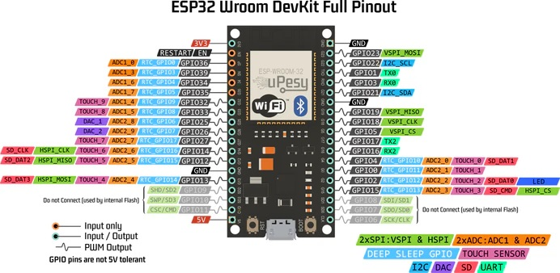
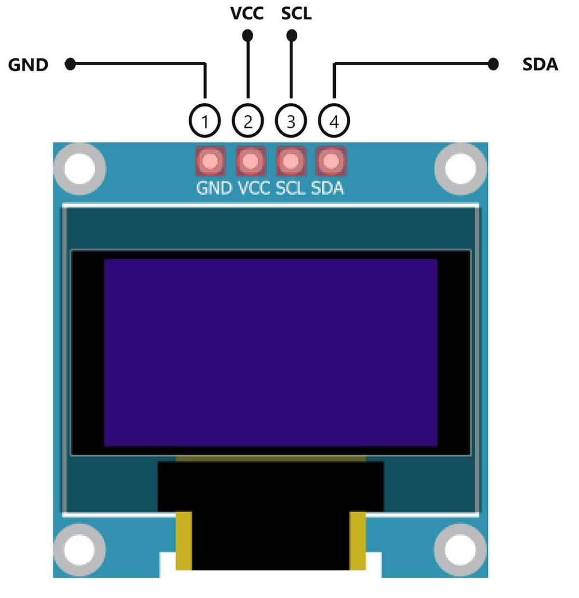

# RadioCast
bluetooth sink / Internet Radio receiver

based on multicore esp32 (needed by audio lib)
use 32 bit DAC for output
basic screen for display
2 buttons for control, short & long press

optional case? (cnc)

# Hardware

## microcrontroler: ESP32S3 WROOM (extended ram)
pre-requisite: DualCore for performances, BT, Wifi

| <!-- -->              | <!-- -->      |
| -----------           | -----------   |
| Microcontroller       | ESP32         |
| Frequency             | 240MHz        |
| Flash                 | 4MB           |
| RAM                   | 320KB         |
| Vendor                | Espressif     |

## Screen: SH1106 128X64 OLED

Communication Lib:
-  [olikraus/u8g2](https://github.com/olikraus/u8g2), potentially compatible with SSD1306
        * strange behaviour from compiler: not finding csrc et cppsrc in u8g2 => Include directive added to platformio.ini

| <!-- -->              | <!-- -->              |
| -----------           | -----------           |
| Resolution            | 128x64                |
| Type                  | OLED                  |
| Voltage               | 3.3V-5V DC            |
| Driver IC             | SH1106                |
| Protocol              | IIC(GND,VCC,SCL,SDA)  |
| Module Size           | 27mmx 27mm x 4mm      |

from AE: (https://fr.aliexpress.com/item/1005004355547926.html)

*Image generation workflow:*
- scale down to YYxZZ
- saved as XMB
- append PROGMEM to declaration

# Implementation choices

## Updating screen

Time management in main loop:
> IF time elapsed since last display update > Frame period  
> THEN  
>     * memorize current time  
>     * increment frame count  
>     * call updateDisplay  

# UI flow

2 functions: 
- Radio from internet
- A2DP bluetooth sink

use Button 1 short press to pass from one to another.
Bluetooth / wifi only activated in their respected mode  
  
1 auxiliary function: Button 1 long press enter WIFI AP configuration mode. Allows to:
- input credential for the Wifi
- update firmware

## Radio

press button2 to cycle between Radio stations. Those are hardcoded

## Bluetooth sink

press button2 to force disconnect