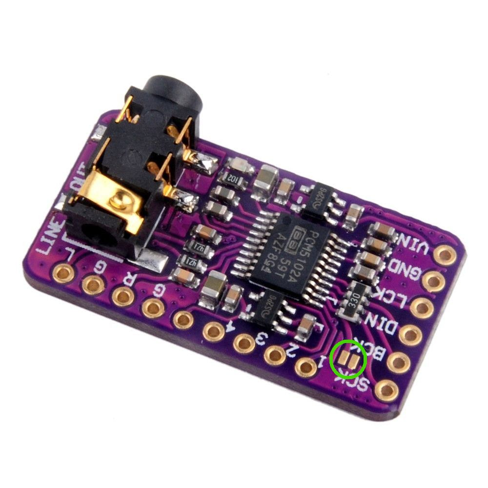

# RadioCast
bluetooth sink / Internet Radio receiver

inspired by : ( https://www.hackster.io/esikora/esp32-audio-project-part-i-internet-radio-with-i-s-dac-a5515c)

based on multicore esp32 (needed by audio lib)
32 bit DAC for output controlled through I2S
12x64 I2C Oled screen for display
2 buttons for control, click & doubleClick & long press

optional case? (cnc)

# Hardware

## microcrontroler: ESP32S3
pre-requisite: DualCore for performances, BT, Wifi

| <!-- -->              | <!-- -->      |
| -----------           | -----------   |
| Microcontroller       | ESP32         |
| Frequency             | 240MHz        |
| Flash                 | 4MB           |
| RAM                   | 320KB         |
| Vendor                | Espressif     |

## Screen: SH1106 128X64 OLED
Communication Lib:
-  [olikraus/u8g2](https://github.com/olikraus/u8g2), potentially compatible with SSD1306
        * strange behaviour from compiler: not finding csrc et cppsrc in u8g2 => Include directive added to platformio.ini

| <!-- -->              | <!-- -->              |
| -----------           | -----------           |
| Resolution            | 128x64                |
| Type                  | OLED                  |
| Voltage               | 3.3V-5V DC            |
| Driver IC             | SH1106                |
| Protocol              | IIC(GND,VCC,SCL,SDA)  |
| Module Size           | 27mmx 27mm x 4mm      |

from AE: [link](https://fr.aliexpress.com/item/1005004355547926.html)

*Image generation workflow:*
- scale down to YYxZZ
- saved as XMB
- append PROGMEM to declaration

## DAC: PCM5102A

| <!-- -->              | <!-- -->              |
| -----------           | -----------           |
| Resolution            | 32bits                |
| Dynamic range         | 212dB                 |
| Voltage               | 3.3V                  |
| Protocol              | I2S(GND,VCC,DIN,BCK,LCK)  **SCK tied to GND** |

from AE: [link](https://fr.aliexpress.com/item/1005005393398013.html)

### Hardware modification:
note that to get a functionning device you must solder the 2 pads close to SCK (or bring it to GND)
Those are circled in green in teh previous picture

On my board, i also had to solder 3 pads of the jack connecter (it was only soldered on one side)

# Implementation choices

## Updating screen

Time management in main loop:
> IF time elapsed since last display update > Frame period  
> THEN  
>     * memorize current time  
>     * increment frame count  
>     * call updateDisplay  

## Switching between features without rebooting

The original projet  couldn't manage to switch beetween Wifi&Bluetooth without crashing due to lack of IRAM.
Even though i properly desallocated booth I2S/WIFI/BT on menu exit, the bluetooth still used an **UNSANE** amount of IRAM.
and if you free it (with .end(true)), you can't start it again.

I found these options:
>-D BOARD_HAS_PSRAM
>-mfix-esp32-psram-cache-issue
>-D CONFIG_BT_ALLOCATION_FROM_SPIRAM_FIRST=1
>-D CONFIG_SPIRAM_CACHE_WORKAROUND=1
enabling the use of PSRAM (ram extension through SPI) but you need a special board/extension board

I used the solution from the "original" project (through define option *MY_ESP32_LACKS_SRAM*) and ordered an ESP32WROVER wich got a buildin 4Mo PSRAM

# UI flow

2 functions: 
- Radio from internet
- A2DP bluetooth sink

use *Button 1* short press to pass from one to another.  
Bluetooth / wifi only activated in their respected mode  
  
1 auxiliary function: *Button 1* long press enter WIFI AP configuration mode. Allows to:
- input credential for the Wifi
- update firmware

## Radio

press *button 2* to cycle between Radio stations. Those are hardcoded
double click cycle back

## Bluetooth sink

press *button 2* to force disconnect

# Build

## 1st version => waste of time

I started soldering all the components to a protoboard source from AE, but my program wasn't working, blocking at I2C init or hallucinating button press.
My best guess is that the board quality was so low than only by connecting to the pads it was inducing noise, triggering interruptions from the buttons or the 2 clock lines....

## 2nd version => working at least

pretty ugly but working well, i will look for a case in my supplies to top it up a notch.

# TODO List
* memorize & load through AP mode :
        - urls list
        - ESP name
* upgrade to ESPWROVER
* case